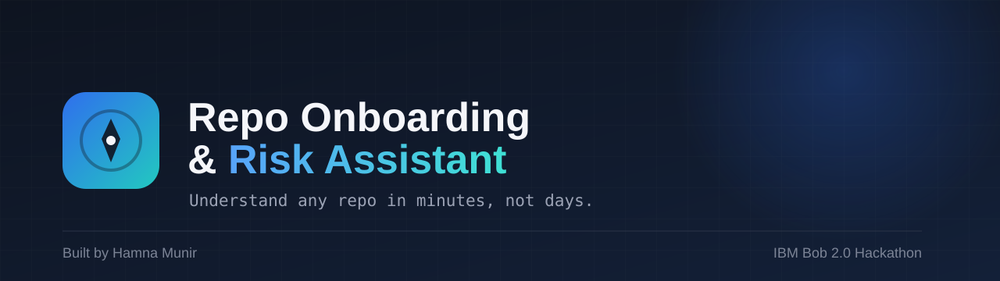

# 🧭 Repo Onboarding & Risk Assistant



**Understand any repo in minutes, not days.**

Built for the [IBM Bob 2.0 Hackathon](https://lablab.ai/ai-hackathons/ibm-bob-2-hackathon) (lablab.ai).

Point it at any GitHub repository and it will:

- 📐 **Map the architecture** — module count, size, and which files everything else depends on
- ⚠️ **Flag risky files** — a 0–100 risk score per module, based on how widely it's depended on, its size, and whether it has tests
- 📝 **Find missing docs & tests** — every undocumented function/class and every untested module, with one-click Bob-drafted docstrings
- 🚀 **Generate a Day-1 Onboarding Brief** — a single, shareable Markdown document a brand-new contributor can actually read on their first day, instead of clicking through four tabs

---

## Why this exists

Joining an unfamiliar codebase is slow and risky: nobody wants to be the person who breaks a file three other modules depend on, or spends their first week just figuring out where things live. This tool turns that ramp-up time into a two-minute scan.

## The IBM Bob integration

This app doesn't just *use* Bob — it's built around Bob Shell (v2.x), IBM's terminal-based coding agent.

- **How it's wired up:** [`src/bob_client.py`](src/bob_client.py) shells out to the `bob run` CLI in headless mode, passing the exact source code of the function/class in question so Bob can answer directly without needing to search the filesystem.
- **Why that matters:** early on, we passed Bob only a function *name* — it would spend 40+ seconds searching the wrong workspace for code that lived elsewhere. Giving Bob the real snippet up front turned that into a fast, accurate, single-shot answer.
- **Graceful fallback:** if Bob Shell isn't installed or no API key is configured, every feature still works — architecture mapping, risk scoring, and gap-finding all run on local Python `ast` analysis with zero external calls. Only the "Draft docstring" action needs Bob; everything else is Bob-independent by design.

## Screenshots

*(Add a screenshot or two here before submitting — a scanned repo's Architecture Summary and the Onboarding Brief make the strongest first impression.)*

## Tech stack

| Layer | Choice |
|---|---|
| UI | [Streamlit](https://streamlit.io) |
| Static analysis | Python's built-in `ast` module (no external parser needed) |
| AI agent | [IBM Bob Shell v2.x](https://bob.ibm.com) (headless CLI mode) |
| Repo ingestion | `git clone` via `subprocess`, or a local folder path |

## Project structure

```
repo-risk-assistant/
├── app.py                  # Streamlit UI — hero, health cards, 4-section nav
├── requirements.txt
├── .env.example             # Copy to .env and fill in your real Bob API key
├── check_bob_key.py         # Diagnostic script: confirms your .env is loading correctly
├── .streamlit/
│   └── config.toml           # Native Streamlit theme (light, blue accent)
└── src/
    ├── analyzer.py            # Core engine: ast parsing, risk scoring, source extraction
    ├── report.py               # Turns raw analysis into UI text/tables/the onboarding brief
    ├── bob_client.py            # IBM Bob Shell adapter (subprocess + transcript parsing)
    ├── repo_source.py           # Resolves a GitHub URL or local path into a scannable folder
    └── theme.py                 # Custom CSS, hero, health cards, nav, footer
```

## Setup

### 1. Clone and install

```bash
git clone <this-repo-url>
cd repo-risk-assistant
python -m venv venv
venv\Scripts\activate        # Windows
source venv/bin/activate     # macOS/Linux
pip install -r requirements.txt
```

### 2. (Optional but recommended) Connect IBM Bob

Without this step, everything runs except AI-drafted docstrings — the app falls back to a clear placeholder instead of crashing.

1. Install Bob Shell:
   ```bash
   # macOS/Linux
   curl -fsSL https://bob.ibm.com/download/bobshell.sh | bash

   # Windows (PowerShell)
   powershell -ep Bypass 'irm -Uri "https://bob.ibm.com/download/bobshell.ps1" | iex'
   ```
   Requires Node.js 22.15.0+. Verify with `bob --version`.

2. Create an API key at [bob.ibm.com](https://bob.ibm.com) → your subscription → **API Keys** → **Create**.

3. Copy `.env.example` to `.env` and paste your key:
   ```
   BOB_API_KEY=your-real-key-here
   ```
   If your key is type **General** (not **Inference**), you'll also need a team ID:
   ```
   BOB_TEAM_ID=your-team-id
   ```

4. Confirm it's loading correctly:
   ```bash
   python check_bob_key.py
   ```

### 3. Run it

```bash
streamlit run app.py
```

Paste a public GitHub URL (or a local folder path) in the sidebar and click **Scan repo**.

## Known limitations

- Only scans Python (`.py`) files — the risk/docstring/test analysis is Python-specific.
- Only public GitHub repos can be cloned by URL (no private-repo auth in this version).
- Bob-drafted docstrings require Bob Shell installed locally; the deployed/hosted version of this app will show the local-analysis fallback unless Bob Shell is also available in that environment.

## Credits

Built by **Hamna Munir** for the IBM Bob 2.0 Hackathon.
